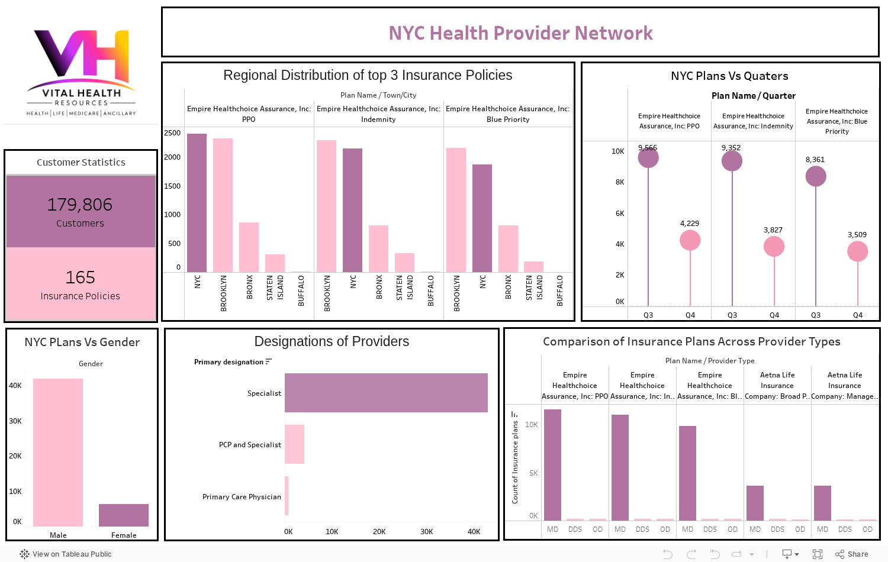
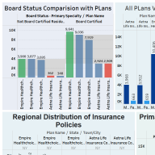

# NYC Healthcare Provider Network - Tableau Dashboard 🏥📊

**Interactive Tableau dashboards analyzing a healthcare provider network - provider mix, regional coverage, plan enrollment by demographic, disease focus, and quarterly trends - to support network-adequacy and health-plan decisions.**

[](https://public.tableau.com/app/profile/nikkat.afrin/viz/NYCInsuranceNetwork/modifieddashboard) 
 [](LICENSE)

---

## 💼 Why this matters
Health plans and provider networks must constantly answer: *do we have the right providers, in the right regions, for the members and conditions we serve?* These dashboards turn raw provider-network data into an at-a-glance view of **network composition, geographic coverage, demographic enrollment, and disease focus** - the inputs to network-adequacy reviews and provider-recruitment strategy.

## 🖼️ Dashboards

### ▶ Interact with the live dashboard on Tableau Public
**<https://public.tableau.com/app/profile/nikkat.afrin/viz/NYCInsuranceNetwork/modifieddashboard>** - filters, tooltips and highlights all work in the browser, no install needed.

[](https://public.tableau.com/app/profile/nikkat.afrin/viz/NYCInsuranceNetwork/modifieddashboard)

*Click the image to open the interactive version.*

### Exploratory analysis



## 📊 What the dashboards show
| View | Question it answers |
|---|---|
| **Provider Types** | What is the mix of provider types in the network? |
| **Regional Distribution** | How are providers/members distributed across regions? |
| **Plan vs Gender** | How does plan enrollment differ by gender? |
| **Plans vs Quarters** | How does plan enrollment trend quarter over quarter? |
| **Primary Disease** | Which primary conditions dominate the population? |
| **Board Status / Summary Stats** | Provider board-certification status and top-line KPIs |

## 🧰 How it was built
- **Tool:** Tableau Desktop (packaged workbooks, `.twbx`).
- **Data:** `Output.csv` (healthcare provider-network extract) packaged inside each workbook.
- **Design:** multiple linked worksheets composed into interactive dashboards with filters; KPI summary tiles for executive readability.

## 📂 Repository contents
```
healthcare-provider-network-tableau/
├── images/      # PNG previews of every dashboard & worksheet (extracted from the .twbx)
├── workbooks/   # the packaged Tableau workbooks (.twbx) - open in Tableau Desktop/Public
└── docs/        # final presentation deck
```

## ▶️ View it
- **Fastest: the live interactive dashboard on Tableau Public** - <https://public.tableau.com/app/profile/nikkat.afrin/viz/NYCInsuranceNetwork/modifieddashboard>
- **Open the workbooks:** download `workbooks/*.twbx` and open in **Tableau Desktop** or **Tableau Public** (free).
- **Live (recommended):** publish to **Tableau Public** and link here → **`ADD_TABLEAU_PUBLIC_LINK`**

> GitHub can't render interactive Tableau, so the dashboards are showcased as images here and (recommended) hosted live on Tableau Public.

## 🛠️ Tech stack
`Tableau` · `Dashboard design` · `Healthcare analytics` · `Data visualization` · `KPI reporting`

## 🚀 Future improvements
- Publish to Tableau Public for interactivity; add parameter controls and tooltips with drill-downs.
- Add network-adequacy ratios (members per provider by region/specialty) as explicit KPIs.

---
*Academic project (Visual Design / VDS final). Provider data is course-supplied; no real patient information.*
